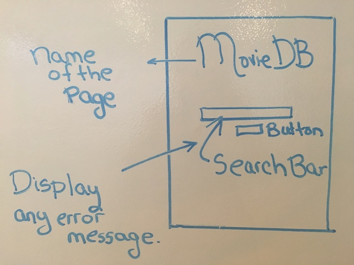
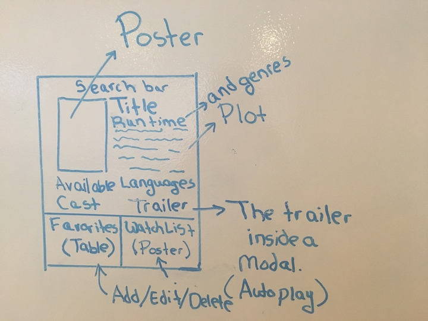
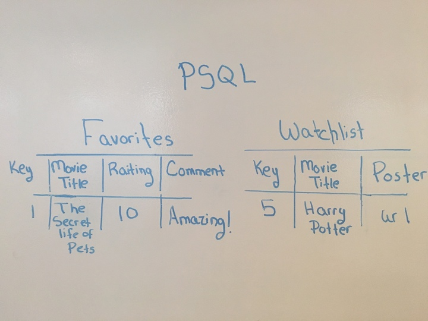

# <a name="tableofcontent">Movie Finder</a>

### Table of Contents

1. [About the project](#about)
2. [Project workflow](#workflow)
3. [Proposal](#step1)
4. [User Stories](#step2)
5. [Wireframes](#step3)
6. [Visual representation of the database](#step4)
7. [Pseudocode](#step5)
8. [Approach taken](#approach)
9. [Technologies used](#technologies)

## <a id="about">About the project</a>

General Assembly's Web Development Immersive  
Project 2 
Developed by Francheska Guzman

This repository was transfered from my [General Assembly's Enterprise GitHub Account](https://git.generalassemb.ly/francheska-guzman) to this account.

## <a name="workflow">Project workflow</a>

| Component | Estimated Time | % Complete  | Actual Time |
| --------------|------------------|-------------|---------------|
| Planning Phase (Steps 1 to 5) and Trello |    5 Hours    |   100%   |  10 Hours  |
|  Installation of Node/Express App, Dependencies and Deploy in Heroku | 3 Hours |   100%   |   2.5 Hours    |
| Search/Display movie information |   5 Hours   |   100%   |   11** Hours    |
|  CRUD |  15 Hours  | 100% |   19 Hours  |

### Link to Trello: https://trello.com/b/HXMvekwJ/project-2-movie-db

## <a name="step1">Step 1: Proposal</a>

My proposal for the second project, is develop a movie database application, where the users can make a query in a search bar, to get movie details (e.g. poster, cast, plot, release information). Users will be able to create, read, update and delete records from their favorite movie list and from the watchlist.

If time permitting, I would like to add a navigation bar, so user can make a search by genre, top rated, and so on. Also, create an authentication log in that enables me to identify an user, and display their favorite movie list and watchlist (so my database will have multiple users).

#### API: https://www.themoviedb.org/documentation/api

## <a name="step2">Step 2: User Stories</a>

1. As a user who wants to find information about a movie, I want to get access to a movie database search.
2. As a user who can make spelling mistakes, or maybe I don't know the complete title of a movie; I would like to get movie title suggestions while writting in the search bar, and/or when press the "Search" button, get a list of similar movie titles.
3. As a user, I would like to search by genres, top rated, and so on. (The implementation of this one, would be the last in my priority list.)
4. As a user, I want to get the movie information in a single page (clean).
5. As a user, I want to add (create), watch (read), edit (update), and delete (delete/destroy) my favorite movies and watchlist; from all movie information pages.
6. As a user, I want a search bar at the top of the movie information; and if is possible, the search by genres, top rated, etc too.

## <a name="step3">Step 3: Wireframes</a>

Index:

Movie Information:

## <a name="step4">Step 4: ERD or other visual representation of the database</a>

First idea:

Current Favorite Table:

| ID | Title | Release Date | Genre(s) | Raiting | Comment |
|----|-------|--------------|----------|---------|---------|

## <a name="step5">Step 5: Pseudocode</a>

### Search

1. Get an API.
2. Create a function that, on a click event, receives a string as an argument.
3. Use DOM to display in the page all the content.

## <a name="approach">Approach taken</a>

After get the search working. Then, implement CRUD functionality in Favorites List. If time permitting, do the Watchlist.

## <a name="technologies">Technologies used</a>

While creating the application, I will be adding details about how I implement each one:

* EJS
* CSS
* JavaScript
* jQuery
* Node.js
* Express
* Third Party API
* PostgreeSQL
* Chrome Developer Tools

### [GO BACK TO THE TABLE OF CONTENT](#tableofcontent)
